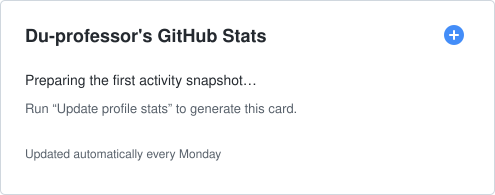

**构建默认安全、可部署、可复现的 AI 系统。** Building secure-by-default, deployable, and reproducible AI systems.

   

## What I'm building / 当前方向

- 🔐 **LLM security gateways** — 为 OpenAI 兼容应用构建本地安全网关，覆盖策略检查、提示词注入防护与模型推理。
- 🧩 **Auditable AI skills** — 沉淀可复用、可审查、可下载的 AI Skills 与自动化工作流。
- 🤖 **Robotic perception** — 探索 ROS 2、视觉 SLAM、占据栅格建图与 GPU 加速机器人系统。

I care about secure defaults, offline deployment, reproducible builds, and documentation that makes complex systems easier to adopt.

## Featured work / 精选项目

| Project | What it delivers | Core stack |
| --- | --- | --- |
| **[LLM Guard Agent](https://github.com/Du-professor/llm-guard-agent)** | 面向 OpenAI 兼容应用的本地安全网关，组合代理层、分类模型、规则与容器化部署。 | `Python` `Go` `ONNX` `Docker` |
| **[AI Skills Collection](https://github.com/Du-professor/AI-Skills-Collection)** | 可复用、可审查的 AI Skill 作品集，支持源码浏览与 ZIP 下载。 | `Python` `AI Skills` `Docs` `Automation` |
| **[ORB-SLAM3 Occupancy](https://github.com/Du-professor/ORB_SLAM3-OCCUPANCY)** | 基于 RealSense D415 与 ROS 2 Humble 的 ORB-SLAM3 稠密建图和 2D 占据栅格实践。 | `C++` `ROS 2` `RealSense` `ORB-SLAM3` |

## Engineering toolkit / 工程技术栈

         

## GitHub activity / GitHub 活动

Generated from public GitHub data and refreshed every Monday by GitHub Actions.

## Collaboration / 开放合作

Open to collaboration on **LLM security, AI agents, secure AI infrastructure, intelligent robotics, and defensive security research**.

欢迎围绕 **大模型安全、智能体工程、安全 AI 基础设施、智能机器人与防御性安全研究** 交流合作。
